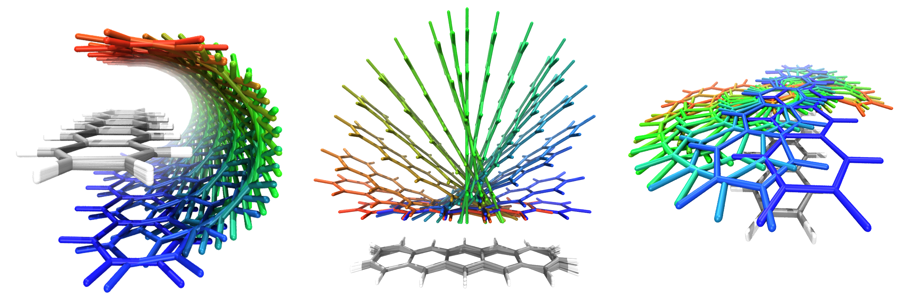

.. _constraints:

Constrained optimization
========================

geomeTRIC supports constrained optimizations in which the value of various geometric variables may be constrained.

To use this feature, create a text file to specify the constraint and pass it to ``geometric-optimize`` after the input file.
As noted in :ref:`Options <options>`, this file may also contain other command line options and arguments before the constraint specifications.

Basic considerations
--------------------

The constraint file format is case-insensitive.
Characters after ``#`` are treated as comments.
Atoms are numbered sequentially starting from 1.

There are three modes of operation for constrained optimization,
which are specified using these keywords:

- ``$freeze`` : The following degrees of freedom should not move from their initial positions.
- ``$set`` : The following degrees of freedom will have their values constrained to the value provided.
- ``$scan`` : The following degrees of freedom have their values scanned from value "A" to value "B" in "C" number of steps.

More than one option can be provided at once (e.g. scanning a bond length while freezing an angle), and
setting multiple constraints in ``$scan`` will result in a multi-dimensional scan.

Examples
--------

Individual constrained degrees of freedom follow the ``$freeze``, ``$set`` and ``$scan`` keywords.
A constraint that freezes the distance between atoms 5 and 6 would look like this::

    $freeze
    distance 5 6

For ``$set``, the value of the constraint (usually a real number) must follow the atom selection.
In order to set the angle between three atoms to a value in degrees::

    $set
    angle 12 13 14 120.0

For ``$scan``, starting and ending values plus a whole number (# of steps) must follow the atom selection.
These jobs are also called *potential energy scanning* or *coordinate driving*.
In order to scan the dihedral angle from 0 degrees to 180 degrees in 15 degree increments::

    $scan
    dihedral 20 21 22 23 0.0 180.0 13
    
Note that although 180/12 = 15, we need 13 steps to be inclusive of both endpoints.  If 12 is specified, then the step size will
be 180/11 = 16.3636.. degrees.

Constraint types
----------------

The constrained degrees of freedom follow the special symbols.
Use one of the following and provide the needed information:

....

``distance`` : The distance between two atoms A-B is constrained.
Provide two numbers for the atomic indices of A and B.
Values provided to ``$set`` and ``$scan`` are in Angstrom.

    Note: If you are looking for constraint type ``bond``, it is called ``distance``
    because distance constraints can be specified between two bonded or non-bonded atoms.

....

``angle`` : The angle between three atoms A-B-C is constrained.
Provide three numbers for the atomic indices of A, B, and C in that order.
Values provided to ``$set`` and ``$scan`` are in degrees.

    Note: Performance may decrease when angles reach near-linear values (175 degrees or higher).

....

``dihedral`` : The dihedral angle defined by four atoms A-B-C-D is constrained.
Provide four numbers for the atomic indices of A, B, and C, and D in that order.
Values provided to ``$set`` and ``$scan`` are in degrees.

    Note: If either of the angles A-B-C or B-C-D become linear during the optimization,
    the optimization will fail because this causes the dihedral angle to become undefined.

....

``x``, ``y``, ``z``, ``xz``, ``yz``, ``xyz`` : The indicated Cartesian coordinates of all selected atoms are constrained in the specified dimensions.

``trans-x``, ``trans-y``, ``trans-z``, ``trans-xz``, ``trans-yz``, ``trans-xyz`` : The geometric center of the selected atoms is constrained in the specified dimensions.

For example, ``yz`` will constrain the y and z-coordinates of the atoms indicated while allowing them to move in the x-direction.

To apply the constraint to one or more atoms, either provide one integer to specify the atom index,
or specify a range of atoms using commas and dashes (no spaces) - (i.e. ``5-7,17,25`` maps to atom indices 5,6,7,17,25).

Values provided to ``$set`` or ``$scan`` are in Angstrom.  The number of values required depends on how many dimensions are constrained:
for example, to use ``xz`` or ``trans-xz`` two numbers are required for ``$set`` and five numbers are required for ``$scan`` for the initial value, final value and number of steps.

....

``rotation`` : The orientation of the specified fragment is constrained. *This is a new feature in geomeTRIC*.

The atom selection uses comma and dash syntax to specify a range of atoms (see above).

The values of the rotation coordinate are given in terms of a rotation axis and a rotation angle relative to the initial structure.

To use ``$set``, provide four total numbers: three numbers for the rotation axis, which is automatically normalized, 
plus a single number for the rotation angle (in degrees) to indicate that the final structure should
be rotated by this amount from the initial angle along the provided axis.

To use ``$scan``, provide six total numbers: three numbers for the rotation axis, which is automatically normalized, 
then three numbers for the initial and final values of the rotation angle (in degrees) and the number of steps.

The above image shows the results of three geomeTRIC scans on two pentacene molecules where
the orientation of one molecule is frozen (C, gray and H, white) and the other molecule's orientation is scanned over a 180-degree range
along three different rotation axes (color indicates the amount of rotation). 
Note that the positions and internal structure of the molecules are relaxed as orientation is scanned.
An example calculation is provided in the ``examples/pentacene`` directory.

The constraints for the calculation in the middle panel is as follows::

    $freeze
    rotation 1-36
    $scan
    rotation 37-72 0.0 1.0 0.0 0.0 175.0 36

Enforcing constraint satisfaction
---------------------------------

In the default constrained optimization algorithm, the constrained degrees of freedom converge to their target values rather slowly if the starting and target values are not the same.
This behavior can be adjusted using the ``--enforce`` command line option.
By passing a parameter such as ``--enforce 0.1`` (for example), the optimizer will switch to an algorithm that `exactly` enforces constraint satisfaction once the current values are within 0.1 of the target.
The units are in bohr/radians, so exact constraint enforcement is turned on when bond length constraints are within 0.1 bohr (about 0.529 Angstrom) and angle/dihedral constraints are within 0.1 rad (about 6.28 degrees) of the target values.
Activating exact constraint enforcement may improve performance in many cases, and it is expected to become the default algorithm after more testing.
