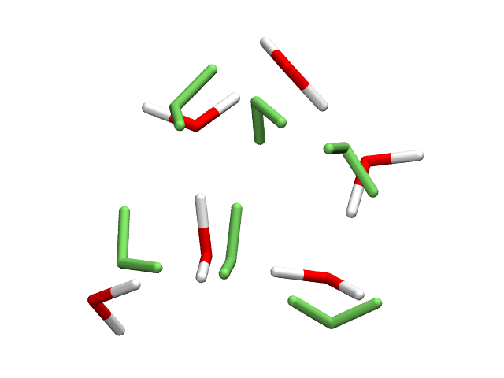
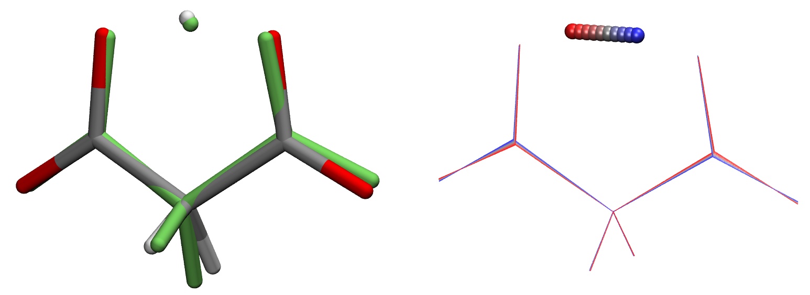
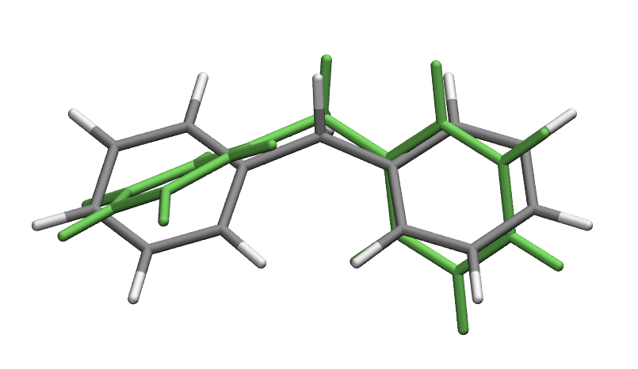
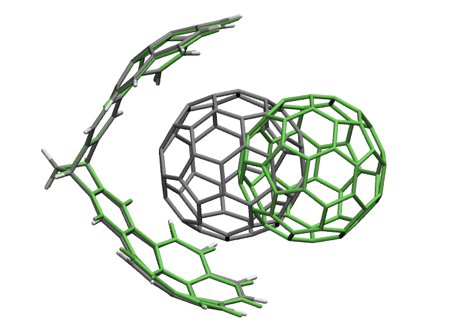
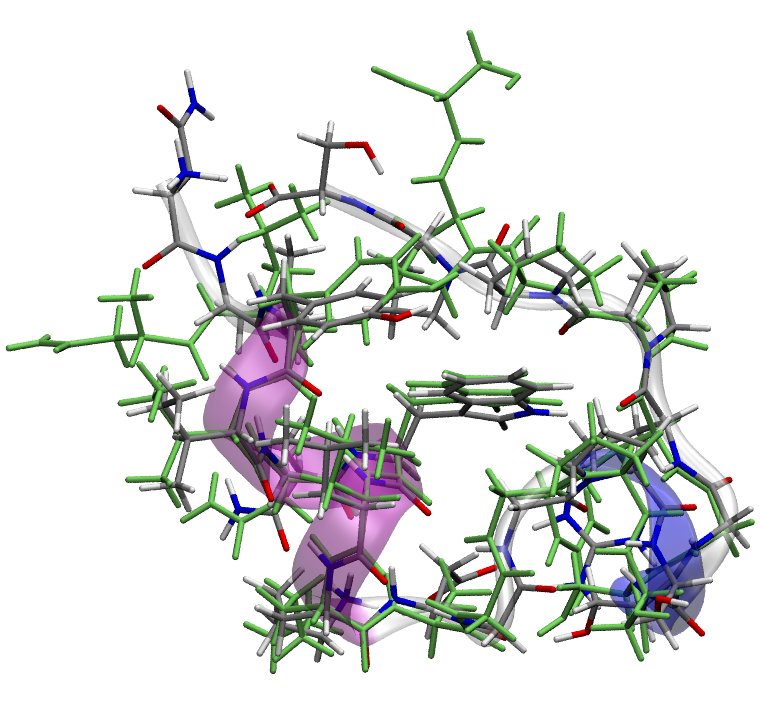
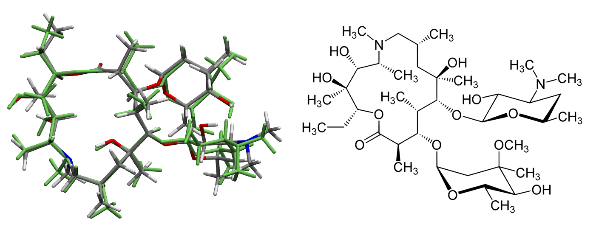

.. _examples:

Examples
========

Example input and output files for geomeTRIC can be found in the ``examples/`` folder of the source tree.  They are organized in the following way:

- ``examples/0-regression-tests``:  These example calculations are also used to measure performance changes.  The purpose is to ensure that geomeTRIC's performance does not degrade over time.  Despite the folder name, they are complete and easily runnable example calculations from the user's perspective.
- ``examples/1-simple-examples``:  Example calculations designed to familiarize the user with running geomeTRIC using different engines and job types.  These examples are designed to run in a few minutes or less, and are an ideal starting point for new users.
- ``examples/2-challenges``:  A collection of calculations that represent "difficult" optimizations, some of which inspired new feature development.  They may require a large number of iterations to converge or passing non-default arguments.  

Organization of an example
--------------------------

The root folder of an example calculation contains the input file(s) and a script ``command.sh``, which contains a single line that shows the command line arguments to geomeTRIC.  The example may be run as follows\: ::

   sh command.sh

In simple examples, the command line arguments specify only the input file and engine name.  More complex examples may require additional command line arguments or auxiliary input files (such as a constraints.txt file).

A reference set of saved calculation outputs are provided in the ``saved/`` subfolder.  Each set of outputs has its own sub-subfolder such as ``saved/2022-07-10`` for the run date, or ``saved/v0.9.7.2`` corresponding to a released version.  These files are for ensuring your calculation is running as expected, and for developers to check that performance has not degraded from past versions.  

.. note::
    If you wish to run the examples, make sure you have the corresponding QC program installed.  Many of the examples use Q-Chem and TeraChem; both are commercial software packages.  geomeTRIC also supports Psi4, which is freely available, as well as the commercial packages Gaussian (G09 or G16) and Molpro.  For more information, refer to the :ref:`Engines <engines>` page.  

    Additionally, many of the calculations use commonly implemented features (such as the B3LYP density functional, 6-31G* basis set, etc.) so you may be able to "translate" the provided input files to the QC program of your choice.  A few examples, such as the water hexamer, have multiple copies available with inputs for different QC programs.

Descriptions of individual examples
-----------------------------------

A few representative examples are provided below.  These and other examples are available in the examples folder.

Energy minimization of water hexamer using Q-Chem
^^^^^^^^^^^^^^^^^^^^^^^^^^^^^^^^^^^^^^^^^^^^^^^^^

- Location: ``examples/0-regression-tests/water6_qchem``
- Command line: ``geometric-optimize --engine qchem water6.qcin``
- Number of atoms: 18
- Theoretical model: HF/STO-3G
- Optimization cycles (approx.): 65
- Run time (approx.): <5 minutes
- Description: Energy minimization of water hexamer using minimal basis Hartree-Fock in Q-Chem. 
  This is a simple example that shows how translation-rotation internal coordinates (TRIC) performs well for optimizing clusters of molecules where translation and rotation are important degrees of freedom.

The above image shows the initial structure (in green) and final optimized structure.  All 3D structures are visualized using VMD.

Transition state optimization of malonate anion using Psi4
^^^^^^^^^^^^^^^^^^^^^^^^^^^^^^^^^^^^^^^^^^^^^^^^^^^^^^^^^^

- Location: ``examples/0-regression-tests/malonate-ts``
- Command line: ``geometric-optimize --engine psi4 --transition yes --hessian first+last run.psi4in``
- Number of atoms: 10
- Theoretical model: HF/3-21G
- Optimization cycles (approx.): 22
- Run time (approx.): 10 minutes
- Description: Transition state optimization of proton transfer reaction in malonate ion.  The starting structure is taken from a high-temperature ab initio MD trajectory (HF/6-31G* @ 600 K) where the proton was roughly equidistant from the acceptor O atoms.  The full Hessian is calculated before and after the optimization, so the total number of gradients is 22 + 120 = 142.  The results of the vibrational analysis are written to ``run.vdata_first`` and ``run.vdata_last``.

The above image shows the initial structure (in green) and final optimized structure, and an overlay of several TS displaced along the imaginary mode.  To visualize the imaginary mode, the ``run.vdata_last`` file was converted to ``run.mode001.xyz`` using the ``anifrq.py`` tool available in ForceBalance.

Constrained energy minimization of diphenylmethane using Psi4
^^^^^^^^^^^^^^^^^^^^^^^^^^^^^^^^^^^^^^^^^^^^^^^^^^^^^^^^^^^^^

- Location: ``examples/0-regression-tests/diphenylmethane``
- Command line: ``geometric-optimize run.psi4in constraints.txt --nt 4 --coordsys dlc --engine psi4 --enforce 0.1``
- Number of atoms: 25
- Theoretical model: B3LYP/6-31G*
- Optimization cycles (approx.): 25
- Run time (approx.): 15 minutes
- Description: Constrained energy minimization of diphenylmethane in Psi4.  The two central bonds of the methylene linker between the two phenyl groups are constrained to be planar.  In the starting structure, the constrained angles differ by about 57 degrees from their target values.  The delocalized internal coordinate system is used (the only difference from TRIC is the addition of overall translation / rotation coordinates in the latter).  Numerically exact constraint satisfaction is activated when the constrained degrees of freedom are within 0.1 a.u. / rad of their target values (this is the default behavior as of version 1.0).

The above image shows the initial structure (in green) and final optimized structure, with the two constrained dihedral angles highlighted in red.  The starting and target values of the two dihedral angles are (57.6, 57.0) and (0.0, 0.0) degrees respectively.

Energy minimization of bucky-catcher using TeraChem
^^^^^^^^^^^^^^^^^^^^^^^^^^^^^^^^^^^^^^^^^^^^^^^^^^^

- Location: ``examples/0-regression-tests/bucky-catcher``
- Command line: ``geometric-optimize --engine tera run.tcin``
- Number of atoms: 135
- Theoretical model: B3LYP-D3/6-31G
- Optimization cycles (approx.): 78
- Run time (approx.): 1 hour
- Description: Energy minimization of "bucky-catcher" in Psi4.  The starting structure is the crystal structure taken from `Yanney et al. <https://doi.org/10.1002/anie.201505327>`_, modified by moving the "ball" away from the "mitt" by about 6 Angstrom.

The above image shows the initial structure (in green) and final optimized structure.

Energy minimization of trp-cage miniprotein using OpenMM
^^^^^^^^^^^^^^^^^^^^^^^^^^^^^^^^^^^^^^^^^^^^^^^^^^^^^^^^

- Location: ``examples/0-regression-tests/trpcage_openmm``
- Command line: ``geometric-optimize --engine openmm --pdb trpcage.pdb amber99sb.xml --prefix run``
- Number of atoms: 304
- Theoretical model: AMBER ff99SB
- Optimization cycles (approx.): 163
- Run time (approx.): 20 minutes
- Description: Energy minimization of Trp-cage miniprotein (20 amino acids) using OpenMM in the gas phase using the AMBER ff99SB force field.  The TRIC coordinate system adds an explicit translation and rotation coordinate for each amino acid residue. The force field XML file ``amber99sb.xml`` is provided as the required input file, and the PDB file containing the initial coordinates is provided using the ``--pdb trpcage.pdb`` option. The output file prefix is changed to ``run``, otherwise it would have defaulted to ``amber99sb`` (taken from the input file name). The force field XML file is not needed in the folder because OpenMM will search in its install path for it.
- Note that the energies that are output by MM calculations are much lower than QC calculations because they do not include the binding energies of electrons.

The above image shows the initial structure (in green) and final optimized structure, as well as the secondary structure of the optimized structure (transparent).

Energy minimization of azithromycin using Gaussian
^^^^^^^^^^^^^^^^^^^^^^^^^^^^^^^^^^^^^^^^^^^^^^^^^^

- Location: ``examples/2-challenges/azithromycin_gaussian``
- Command line: ``geometric-optimize --engine gaussian start.gjf``
- Number of atoms: 124
- Theoretical model: B3LYP/6-31G*
- Optimization cycles (approx.): 47
- Run time (approx.): 9 hours
- Description: Energy minimization of azithromycin using Gaussian at the B3LYP/6-31G* level of theory.  The long runtime is due to the cost of the single point Gaussian calculations, which average around 12 minutes using 4 cores on the test machine (Intel i7-6850K CPU @ 3.60GHz).  For this particular example geomeTRIC converges more rapidly than Gaussian 16's native optimizer.

The above image shows the initial structure (in green) and final optimized structure, with the 2D structure on the right for reference.

