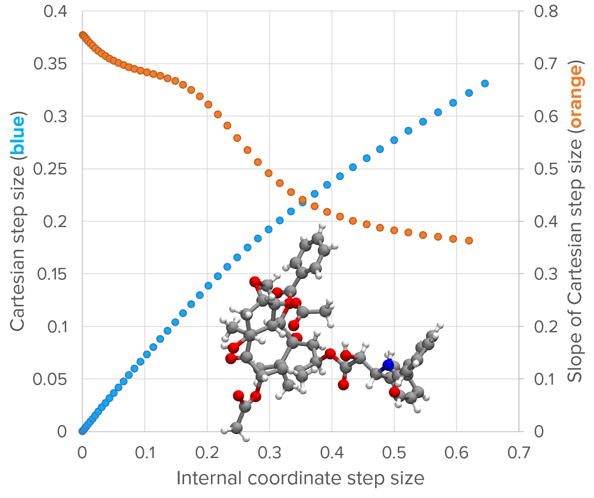

.. _how-it-works:

How It Works
============

This section explains the basic methods and some computational details of how geomeTRIC carries out geometry optimization.
Parts of the procedure may be modified depending on the type of calculation that is run (transition state, MECI, etc.) and are described in the corresponding section.
Some explanations of the codes are included in lieu of a full developer's guide, which may be added in the future.

Basics
------

Before the optimization starts, the following needs to be done:

a. Read initial structure, QC input, user parameters, and any constraints
b. Create ``Molecule`` and ``Engine`` object
c. Set up the internal coordinate system
d. Perform an initial calculation of the energy and Cartesian gradient
e. Calculate a guessed or numerical internal coordinate Hessian matrix

The optimization itself is carried out in a loop structure:

1. Calculate the optimization step (i.e. the next iteration of the structure)
2. Calculate the energy and Cartesian gradient for the new structure
3. Evaluate convergence criteria. If converged, exit.
4. Assess step quality and adjust trust radius accordingly.
5. Update the Hessian matrix, and return to step 1.

Top level functions
-------------------

When ``geometric-optimize`` is called on the command line, the parsed command line arguments are passed to the top level function ``optimize.run_optimizer()``.
All of the user inputs that directly affect geomeTRIC's behavior are stored in a class called ``params.OptParams`` which also assigns default values based on the calculation type (i.e. energy minimization, transition state, MECI or other).
``OptParams`` contains optimization-relevant parameters such as the trust radius and convergence criteria, and does not contain information about the molecular structure (handled by the ``Molecule``), the QC software (the ``Engine``), or the internal coordinates.

.. note::
    An alternative to calling geomeTRIC from the command line is to use the JSON API found in ``run_json.geometric_run_json()``. 
    This function accepts a JSON dictionary instead of parsed command line arguments, and is presently used for interfacing with MolSSI's `QCFractal <http://docs.qcarchive.molssi.org/projects/QCFractal/en/stable/>`_.

    If you are a developer and you want to interface your code with geomeTRIC using a API rather than a command line, you can follow the example of ``optimize.run_optimizer()`` and ``run_json.geometric_run_json()``.  Basically, all you need to do is write a function that sets up the four key objects (``Molecule``, ``InternalCoordinates``, ``Engine``, ``OptParams``) which are needed to set up the main ``optimize.Optimizer`` class.

Molecule and Engine
-------------------

The user inputs are used to create a ``Molecule`` and ``Engine`` object.

The ``molecule.Molecule`` class contains information about the coordinates and topology (i.e. atomic data and connectivity) of a molecular system with one or more structures.
It is mainly used to read/write coordinate files (such as ``.xyz`` format) and construct connectivity graphs based on distance criteria or bond order matrices.
(It is also a useful file format conversion and coordinate manipulation tool that can be used outside of geometry optimization for various purposes).

The various subclasses of ``engine.Engine`` are interfaces to different QC (and MM) programs for calculating the energy and Cartesian gradient.
At the time of calculation setup, the user-provided QC input file is typically stored as a template that geomeTRIC writes to disk with modifications as the optimization is progressing (for example, by modifying the Cartesian coordinates while keeping the rest of the file the same).
The key function that any ``Engine`` subclass must have is ``calc_new(coords)``, which accepts a flattened :math:`3 \times N_{\mathrm{atoms}}` array of Cartesian coordinates (in Bohr, ordered as :math:`x_1, y_1, z_1, x_2, y_2, z_2...`) and returns a dictionary as ``{"energy" : energy, "gradient" : gradient}`` containing the energy (in Hartree) and Cartesian gradient (as a flattened array in Hartree/Bohr).

.. note::
    The ``tests/test_customengine.py`` module shows how almost any energy function could be used to calculate the energy and gradient.  This was originally added by the `PySCF <https://pyscf.org/user/geomopt.html>`_ developers as an interface to their software.

Internal coordinate setup
-------------------------

The internal coordinate system is set up based on the atomic connectivity and user-specified coordinate system type.
In most cases the atomic connectivity is determined automatically in ``Molecule.build_topology()`` in which two atoms are considered to be bonded if :math:`r_{ij} < 1.2 (R_i + R_j)`; the covalent radii parameters :math:`R_i, R_j` are taken from `Cordero et al. <https://pubs.rsc.org/en/content/articlelanding/2008/dt/b801115j>`_ (see here for an :ref:`exception <transition_tric>` to the procedure).

Once the connectivity is determined, the *primitive internal coordinate system* is generated.
This is essentially a list of individual internal coordinates (ICs) that represent individual distances, angles, dihedral angles, etc.
In the standard prescription for IC generation, distances are added for each connected atom pair, angles are added for every triplet of connected atoms, and dihedral angles are added for every "linear" connected quartet, following the procedure of `Schlegel et al. <https://link.springer.com/article/10.1007/BF00554788>`_
Depending on the initial structure, special ICs may be added if geometric criteria are met (e.g. a ``LinearAngle`` is used instead of ``Angle`` if three atoms are nearly linear).
Each individual internal coordinate has methods ``value()``, ``derivative()``, ``second_derivative()`` that compute the corresponding quantity given a flattened array of Cartesian coordinates in Bohr.
For example, ``Distance.derivative()`` will return a 2-dimensional :math:`N_{\mathrm{atoms}} \times 3` array where only two rows of the array are nonzero.

When the output of ``derivative()`` for each IC in the list is flattened, then vertically stacked to make a 2-dimensional :math:`N_{IC} \times 3 N_{\mathrm{atoms}}` array, the result is called the *Wilson B-matrix* whose elements are :math:`dq_i / dx_j`.
Taking the product :math:`G = BB^T` forms the *G-matrix*, which is an overlap matrix between the ICs.
Because the number of primitive ICs can easily exceed the dimension of the configuration space, the G-matrix often has a number of zero eigenvalues corresponding to linear dependencies; this is also why primitive internal coordinates is often called "redundant" in the literature.

To reduce computational cost and improve numerical stability, a `delocalization procedure <https://aip.scitation.org/doi/10.1063/1.471864>`_ may be performed in which the G-matrix calculated using the initial structure is diagonalized, resulting in a number of eigenvectors with nonzero eigenvalues (usually :math:`3 N_{\mathrm{atoms}}` or :math:`3 N_{\mathrm{atoms}} - 6`) that represent non-redundant linear combinations of the primitive ICs.
The linear combinations are then used in place of the primitive ICs for the geometry optimization without updating the coefficients.
Because each new coordinate combines multiple primitive ICs, they are said to be "delocalized".

When there is more than one molecular fragment, a challenge arises because the standard ICs within the molecular fragments are not enough to fully span the configuration space.
This is where the different coordinate system types start to behave differently:

* Translation-rotation internal coordinates (TRIC), ``--tric`` (the default): Add three translation ICs and three rotation ICs for each separate molecular fragment, following `Wang and Song (2016) <https://aip.scitation.org/doi/10.1063/1.4952956>`_. Within each molecular fragment, add standard internal coordinates. The delocalization procedure is performed. The number of non-redundant ICs should always be :math:`3 N_{\mathrm{atoms}}`.
* Cartesian coordinates, ``--cart``: Do not add any internal coordinates, but instead add :math:`3 N_{\mathrm{atoms}}` "trivial" ICs representing each atom's Cartesian x-, y, and z-coordinates.  This represents the base case that internal coordinates are designed to improve upon.
* Primitive internal coordinates, ``--prim``: Create a minimum spanning tree that includes pseudo-bonds between any non-bonded fragments. Add internal coordinates for the resulting tree, including distances / angles / dihedral angles that include the pseudo-bonds. Also called "redundant internal coordinates".
* Delocalized internal coordinates, ``--dlc``: Form the same primitive ICs as ``--prim``, then perform the delocalization procedure, following `Baker (1996) <https://aip.scitation.org/doi/10.1063/1.471864>`_. The number of non-redundant ICs is usually :math:`3 N_{\mathrm{atoms}} - 6` due to the lack of overall translation and rotation.
* Hybrid delocalized internal coordinates, ``--hdlc``: Do not create a minimum spanning tree but add :math:`N_{\mathrm{atoms}} \times 3` Cartesian coordinate ICs, then perform the delocalization procedure, following `Billeter et al. (2000) <https://pubs.rsc.org/en/content/articlelanding/2000/cp/a909486e>`_. The number of non-redundant ICs should always be :math:`3 N_{\mathrm{atoms}}`.
* Primitive TRIC, ``--tric-p``: Same primitive ICs as TRIC, but do not perform the delocalization procedure. Used for testing.

The TRIC coordinate system was first implemented in geomeTRIC and was the original motivation for its development.
The main hypothesis was that adding explicit ICs for translation and rotation should give a more natural representation of changes in molecular position and orientation compared to the existing approaches of adding pseudo-bonds or a full set of Cartesian coordinates.
For more details please check out `our paper <https://aip.scitation.org/doi/10.1063/1.4952956>`_.

Initial Hessian
---------------

Energy minimizations start with a guessed diagonal Hessian matrix in the primitive internal coordinates.
The diagonal elements are assigned following `Schlegel et al <https://link.springer.com/article/10.1007/BF00554788>`_, with a small modification that the dihedral elements are fixed at a constant value of 0.023, rather than depending on distance as in the original publication.
The initial diagonal elements for translation and rotation coordinates are set to 0.05.
On the other hand, the default behavior in :ref:`transition state <transition>` optimizations is to calculate the full Hessian by finite difference of the gradient, because it is important to have the correct local shape of the PES for those calculations.

Optimization step
-----------------

GeomeTRIC uses a trust radius quasi-Newton method to determine the optimization step for energy minimization; this is also called Levenberg-Marquardt when applied to nonlinear least squares fitting.
A proposed internal coordinate (IC) step is obtained as:

.. math::
   \boldsymbol{\delta}^{(q)} = -(\mathbf{H}^{(q)} + \lambda I)^{-1} \mathbf{g}^{(q)}
   :label: newton_step

where :math:`\mathbf{H}^{(q)}` and :math:`\mathbf{g}^{(q)}` are the IC Hessian (approximate) and gradient respectively, and :math:`\lambda` is a regularization parameter that controls the step size.
At :math:`\lambda \rightarrow 0` the full quasi-Newton step is recovered, and :math:`\lambda \rightarrow \infty` corresponds to an infinitely small steepest descent step.

The IC gradient is calculated from the Cartesian gradient as:

.. math::
   \mathbf{g}^{(q)} = \mathbf{G}^{\dagger} \mathbf{B} \mathbf{g}^{(x)}
   :label: gradient_ic

The matrix :math:`\mathbf{G}` is inverted by taking the singular value decomposition and inverting only the singular values larger than :math:`10^{-6}`.
The approximate IC Hessian comes from having applied the :ref:`BFGS update <bfgs-update>` at the end of the previous optimization step.

Conversion to Cartesian step
""""""""""""""""""""""""""""

Because the ICs are nonlinear functions of the Cartesian coordinates, a proposed IC step must be iteratively converted into a proposed Cartesian step.
An approximate Cartesian step :math:`\boldsymbol{\delta}^{(x)}_1` is obtained as:

.. math::
   \begin{aligned}
   & \boldsymbol{\delta}^{(x)}_1 = \left[ \mathbf{B}^T \mathbf{G}^{\dagger} \right] (\mathbf{x}_0) \boldsymbol{\delta}^{(q)} \\
   & \mathbf{x}_1 = \mathbf{x}_0 + \boldsymbol{\delta}^{(x)}_1
   \end{aligned}
   :label: dx_firstiter

Because the step is approximate, the difference between the new and old ICs does not exactly match the IC step originally provided :math:`\boldsymbol{\delta}^{(q)}`.  The remaining gap between the target and current ICs is given by:

.. math::
   \boldsymbol{\delta}^{(q)}_1 = \boldsymbol{\delta}^{(q)} - (\mathbf{q}(\mathbf{x}_1) - \mathbf{q}(\mathbf{x}_0))
   :label: dx_dq_gap

.. note::
    When calculating the IC differences, special care is taken to account for jumps in :math:`2\pi` for periodic coordinates. 

:math:`\boldsymbol{\delta}^{(q)}_1` is now set to the target IC step using :math:`\mathbf{x}_1` as the input coordinates, and the next step is taken as:

.. math::
   \begin{aligned}
   & \boldsymbol{\delta}^{(x)}_2 = \left[ \mathbf{B}^T \mathbf{G}^{\dagger} \right] (\mathbf{x}_1) \boldsymbol{\delta}^{(q)}_1 \\
   & \mathbf{x}_2 = \mathbf{x}_1 + \boldsymbol{\delta}^{(x)}_2
   \end{aligned}
   :label: dx_nextiter

The iterations are repeated until the IC change from the initial coordinates matches the target step to within :math:`10^{-6}`, i.e.

.. math::
   \left| \boldsymbol{\delta}^{(q)} - (\mathbf{q}(\mathbf{x}_n) - \mathbf{q}(\mathbf{x}_0)) \right| < 10^{-6}
   :label: dx_converge

The Cartesian step that matches the IC is obtained as :math:`\boldsymbol{\delta}^{(x)} = \mathbf{x}_n - \mathbf{x}_0`.

Controlling the step size
"""""""""""""""""""""""""

The trust radius is defined in Cartesian coordinates because primitive internal coordinates do not have a consistent unit system.
Our goal is to find the value of :math:`\lambda` such that the Cartesian RMSD is as large as possible with :math:`R_{\mathrm{trust}}` as an upper bound.
The Cartesian step is first calculated by finding :math:`\boldsymbol{\delta}^{(x)}(\boldsymbol{\delta}^{(q)}(\lambda))` as above, then the RMSD is calculated as:

.. math::
    \mathrm{RMSD} = \sqrt{\frac{1}{N_{\mathrm{atoms}}} \displaystyle\sum_{i=1}^{N_{\mathrm{atoms}}} (\Delta x_i^2 + \Delta y_i^2 + \Delta z_i^2)}
   :label: rmsd

(Note the denominator is :math:`N_{\mathrm{atoms}}` and not :math:`3N_{\mathrm{atoms}}`.)
In some cases, the full quasi-Newton step is already within the trust radius, then we proceed to evaluating the energy and gradient for the new coordinates.
If the step needs to be restricted, the value of :math:`\lambda` is found numerically by optimizing the IC step size norm :math:`r_{IC}` as an intermediate variable.
A line search is performed to find the root of the function:

.. math::
   f(r_{IC}) = \mathrm{RMSD}(\boldsymbol{\delta}^{(x)}(r_{IC})) - R_{\mathrm{trust}}
   :label: f_root

which represents the deviation of the Cartesian step size from the trust radius as a function of the IC step size.
This implicit function is evaluated by first optimizing the value of :math:`\lambda` such that the IC step length satisfies :math:`|\boldsymbol{\delta}^{(q)}| = r_{IC}`, then converting the step to Cartesian coordinates and calculating the RMSD.
This is designed to minimize the number of times the IC step is converted to Cartesians because it is itself an iterative nonlinear procedure.

The above image shows the relationship between :math:`r_{IC}` (x-axis) and the RMSD (left y-axis; blue) for the structure shown (the taxol example at the 10th optimization cycle)
The plot is generated by scanning the value of :math:`r_{IC}`, optimizing :math:`\lambda` for each value, the calculating :math:`\boldsymbol{\delta}^{(x)}` and the RMSD.

The optimization of :math:`\lambda` for a target step size (i.e. :math:`|\boldsymbol{\delta}^{(q)}| \rightarrow r_{IC}` follows `Hebden et al. <https://citeseerx.ist.psu.edu/viewdoc/summary?doi=10.1.1.716.2997>`_
The derivative of the step size with respect to :math:`\lambda_n` at iteration :math:`n` is given by:

.. math::
   |\boldsymbol{\delta}^{(q)}|^\prime = \frac{d |\boldsymbol{\delta}^{(q)}|}{d \lambda_n} = -\frac{(\boldsymbol{\delta}^{(q)}) \cdot (\mathbf{H} + \lambda_n I)^{-1} \cdot \boldsymbol{\delta}^{(q)}}{|\boldsymbol{\delta}^{(q)}|}
   :label: dy_prime

The next iteration of :math:`\lambda` is then calculated as:

.. math::
   \lambda_{n+1} = \lambda_n = \left(1 - \frac{|\boldsymbol{\delta}^{(q)}|}{r_{IC}} \right) \cdot \frac{|\boldsymbol{\delta}^{(q)}|}{|\boldsymbol{\delta}^{(q)}|^\prime}
   :label: lambda_iter

The convergence tolerance for :math:`\lambda` is 0.1% of the target IC step size.
Once :math:`\lambda` is converged, we evaluate the Cartesian step and :math:`f(r_{IC})`. 
A line search is then carried out find the root of :math:`f(r_{IC})`; we use `Brent's method <https://maths-people.anu.edu.au/~brent/pub/pub011.html>`_ as it is derivative-free and highly robust.
The convergence tolerance of Brent's method is set to 10% of the trust radius, so that the restricted step does not exactly match the trust radius; again, this is intended to reduce the number of times the IC step is converted to Cartesian coordinates.
Upon convergence, the Cartesian coordinates are updated for the next energy and gradient calculation.

If this procedure fails to produce Cartesian coordinates meeting this criteria, then the coordinate system is declared to be "bad", the IC system is rebuilt from scratch using the current structure, and another attempt is made.
Two failures in a row will cause the optimizer to switch to Cartesian coordinates - but we don't have any cases where this happens reproducibly, and we'd like to hear about any cases that are encountered out in the field.

The step size control algorithm can be summarized as:

1. Starting with :math:`\lambda = 0`, calculate :math:`\boldsymbol{\delta}^{(q)}, \boldsymbol{\delta}^{(x)}` and the RMSD.  If :math:`\mathrm{RMSD}(\boldsymbol{\delta}^{(x)}) < R_{\mathrm{trust}}`, then proceed to calculating the energy and gradient.  Otherwise, go to step 2.
2. Start Brent's method to find the root of :math:`f(r_{IC})` such that :math:`f(r_{IC}) = \mathrm{RMSD}(\boldsymbol{\delta}^{(x)}(r_{IC})) - R_{\mathrm{trust}} \approx 0`.  The starting values of the root finding bracket are :math:`(0, f(0) = -R_{\mathrm{trust}})` and :math:`(|\boldsymbol{\delta}^{(q)}|(\lambda=0), \mathrm{RMSD}(\boldsymbol{\delta}^{(x)}(\lambda = 0)) - R_{\mathrm{trust}})`.
3. For each trial value of :math:`r_{IC}` from Brent's method, find :math:`\lambda` such that :math:`|\boldsymbol{\delta}^{(q)}|(\lambda=0) = r_{IC}` to within 0.1%. Using the converged value of :math:`\lambda` and the corresponding :math:`\boldsymbol{\delta}^{(q)}`, evaluate :math:`\boldsymbol{\delta}^{(x)}` and the RMSD.
4. Iterate through Brent's method until :math:`f(r_{IC})` is converged to within 10% of the trust radius.
5. Use the converged :math:`\boldsymbol{\delta}^{(x)}` to update the Cartesian coordinates for the next energy and gradient calculation.

Convergence criteria
--------------------

By default geomeTRIC checks five convergence criteria: the RMS and maximum gradient component (in Hartree/bohr), the RMS and maximum displacement (in Angstrom), and the energy change (in Hartree).
The RMS and maximum values are calculated from the norms of the gradient and displacement for each atom, following Eq. :eq:`rmsd`.
An additional criterion is added to ensure that constraints are satisfied before the calculation is deemed converged.

The convergence criteria may be changed either as a set, by passing ``--converge gau``, or by passing one or more name / value pairs such as ``--converge energy 1e-6 grms 3e-4 gmax 4.5e-4 drms 1.2e-3 dmax 1.8e-3`` (the examples are simply the default criteria).

+----------------------+-----------------------------+-----------------------------+-----------------------------+------------------------------+-----------------------------+
| Convergence          | Energy                      | Gradient                    | Gradient                    | Displacement                 | Displacement                |
| Set                  | change                      | (RMS)                       | (Max)                       | (RMS)                        | (Max)                       |
+======================+=============================+=============================+=============================+==============================+=============================+
| ``GAU (default)``    | :math:`1.0 \times 10^{-6}`  | :math:`3.0 \times 10^{-4}`  | :math:`4.5 \times 10^{-4}`  | :math:`1.2 \times 10^{-3}`   | :math:`1.8 \times 10^{-3}`  |
+----------------------+-----------------------------+-----------------------------+-----------------------------+------------------------------+-----------------------------+
| ``NWCHEM_LOOSE``     | :math:`1.0 \times 10^{-6}`  | :math:`3.0 \times 10^{-3}`  | :math:`4.5 \times 10^{-3}`  | :math:`3.6 \times 10^{-3}`   | :math:`5.4 \times 10^{-3}`  |
+----------------------+-----------------------------+-----------------------------+-----------------------------+------------------------------+-----------------------------+
| ``GAU_LOOSE``        | :math:`1.0 \times 10^{-6}`  | :math:`1.7 \times 10^{-3}`  | :math:`2.5 \times 10^{-3}`  | :math:`6.7 \times 10^{-3}`   | :math:`1.0 \times 10^{-2}`  |
+----------------------+-----------------------------+-----------------------------+-----------------------------+------------------------------+-----------------------------+
| ``TURBOMOLE``        | :math:`1.0 \times 10^{-6}`  | :math:`5.0 \times 10^{-4}`  | :math:`1.0 \times 10^{-3}`  | :math:`5.0 \times 10^{-4}`   | :math:`1.0 \times 10^{-3}`  |
+----------------------+-----------------------------+-----------------------------+-----------------------------+------------------------------+-----------------------------+
| ``INTERFRAG_TIGHT``  | :math:`1.0 \times 10^{-6}`  | :math:`1.0 \times 10^{-5}`  | :math:`1.5 \times 10^{-5}`  | :math:`4.0 \times 10^{-4}`   | :math:`6.0 \times 10^{-4}`  |
+----------------------+-----------------------------+-----------------------------+-----------------------------+------------------------------+-----------------------------+
| ``GAU_TIGHT``        | :math:`1.0 \times 10^{-6}`  | :math:`1.0 \times 10^{-5}`  | :math:`1.5 \times 10^{-5}`  | :math:`4.0 \times 10^{-5}`   | :math:`6.0 \times 10^{-5}`  |
+----------------------+-----------------------------+-----------------------------+-----------------------------+------------------------------+-----------------------------+
| ``GAU_VERYTIGHT``    | :math:`1.0 \times 10^{-6}`  | :math:`1.0 \times 10^{-6}`  | :math:`2.0 \times 10^{-6}`  | :math:`4.0 \times 10^{-6}`   | :math:`6.0 \times 10^{-6}`  |
+----------------------+-----------------------------+-----------------------------+-----------------------------+------------------------------+-----------------------------+

.. note::
   Despite the names of the convergence sets, these convergence criteria are not exactly equivalent to other software packages due to differences in how the RMS/maximum is computed, the number of criteria used, etc.

Additionally, geomeTRIC supports Q-Chem-style and Molpro-style convergence criteria following the conventions of these packages. 
Q-Chem requires the RMS gradient and *either* the RMS displacement or the energy change to fall below their criteria.
Similarly, Molpro requires the maximum gradient and *either* the maximum displacement or the energy change to fall below their criteria.
These alternate convergence conditions can be activated by passing ``--qccnv yes`` or ``-molpro yes`` on the command line.

Trust radius adjustment
-----------------------

If the calculation is not converged yet, the step quality is calculated as:

.. math::
    \begin{aligned}
    & Q = \frac{\Delta E_{\mathrm{actual}}}{\Delta E_{\mathrm{pred}}} \\
    & \textrm{where }\Delta E_{\mathrm{pred}} = \frac{1}{2} \boldsymbol \delta \cdot \mathbf{H} \cdot \boldsymbol \delta + \boldsymbol \delta \cdot \mathbf{g}
    \end{aligned}
   :label: min_quality

where :math:`\boldsymbol \delta, \mathbf{g}, \mathbf{H}` are the optimization step, gradient, and Hessian, in internal coordinates (the subscript (q) has been dropped).
The denominator is the predicted energy change from the second order Taylor series expansion.
The trust radius is adjusted based on the value of :math:`Q` as follows:

* :math:`Q \geq 0.75` : "Good" step, trust radius is increased by a factor of :math:`\sqrt{2}`, but not greater than the maximum.
* :math:`0.75 > Q \geq 0.25` : "Okay" step, trust radius is unchanged.
* :math:`0.25 > Q \geq -1.0` : "Poor" step, trust radius is decreased by setting it to :math:`0.5 \times \mathrm{min}(R_{\mathrm{trust}}, \mathrm{RMSD})`, but not lower than the minimum.
* :math:`Q < -1.0` : Step is rejected in addition to decreasing the trust radius as above.

.. _bfgs-update:

BFGS Hessian Update
-------------------

If the optimization step is accepted, the IC Hessian matrix is then updated before taking the next optimization step using the BFGS formula:

.. math::
   \mathbf{H}_{n+1} = \mathbf{H}_n + \frac{\boldsymbol{\gamma} \otimes \boldsymbol{\gamma}}{\boldsymbol{\gamma} \cdot \boldsymbol{\delta}} - \frac{(\mathbf{H} \cdot \boldsymbol \delta) \otimes (\mathbf{H} \cdot \boldsymbol \delta)}{\delta \cdot \mathbf{H} \cdot \delta}
   :label: bfgs_update

where :math:`\gamma = \mathbf{g}_{n+1} - \mathbf{g}_{n}` and all quantities are in internal coordinates.
The use of the BFGS formula is standard in geometry optimization because it ensures that a positive definite input Hessian matrix retains this property after the update if :math:`\boldsymbol{\gamma} \cdot \boldsymbol{\delta}`. 
If the dot product is negative, then the updated Hessian may have a negative eigenvalue, which usually causes a reset of the Hessian to the guess.

.. note::
   A possible way to improve performance could be to modify the optimizer to perform a line search in cases where BFGS does not return a positive definite Hessian matrix, until the Wolfe conditions are satisfied.
